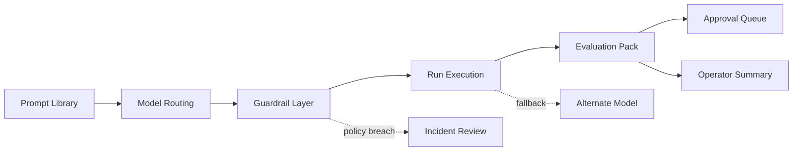
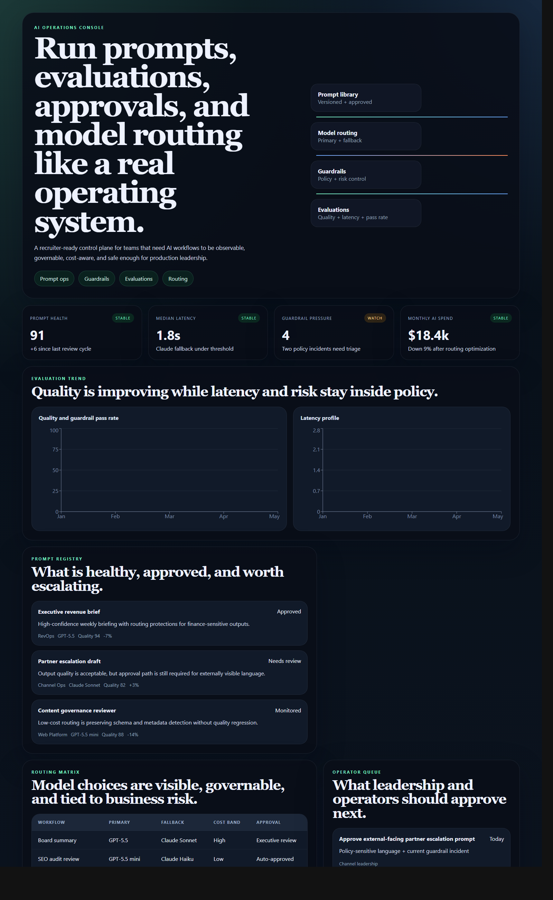
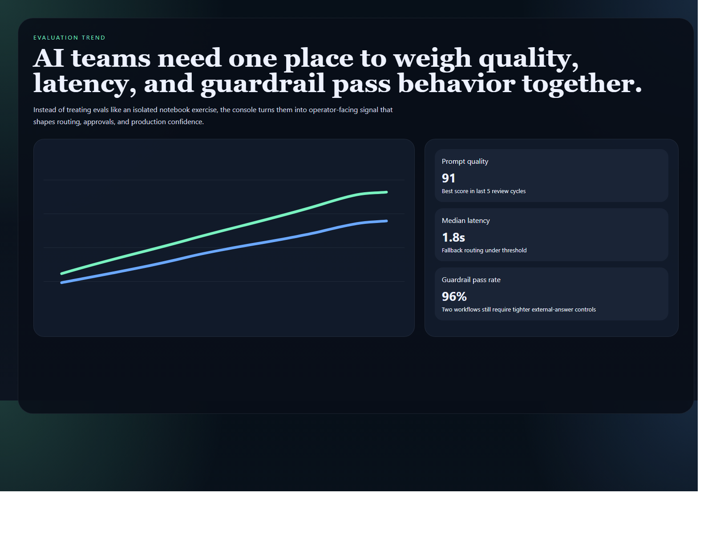
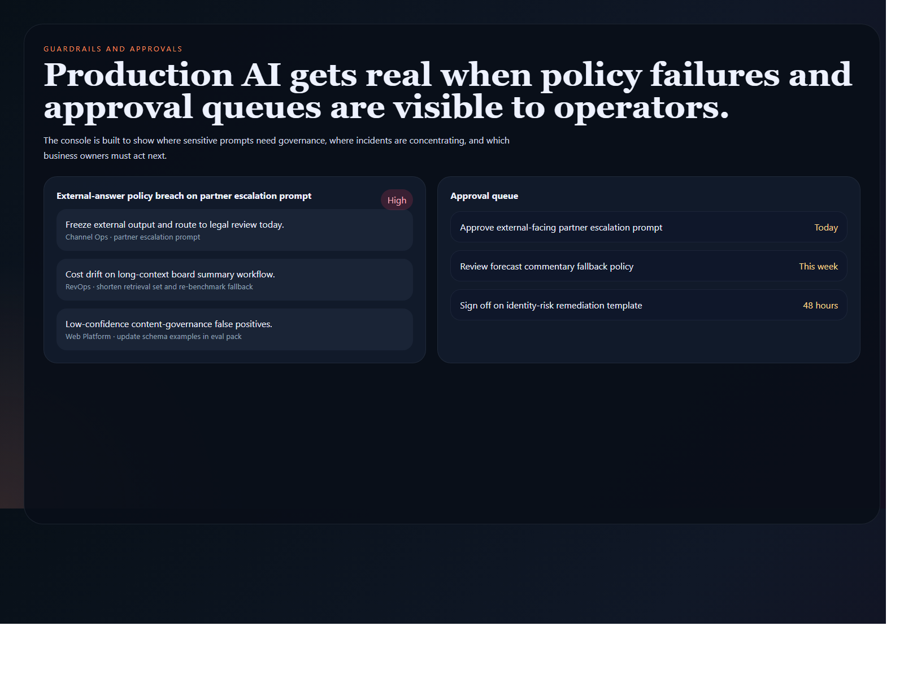
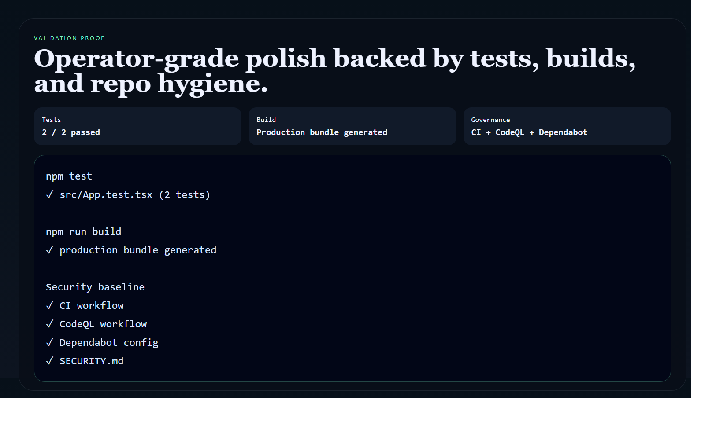

# AI Operations Console

> **React + TypeScript portfolio project** demonstrating prompt operations, evaluation visibility, model routing, guardrail tracking, and operator-grade AI workflow governance.

**Recruiter takeaway:** *"This person understands AI systems as operational products, not just demos."*

---

## Project Overview

| Attribute | Detail |
|---|---|
| **Frontend Stack** | React 19 + Vite + TypeScript |
| **Domain** | AI operations, prompt governance, evaluations, guardrails |
| **Audience** | AI teams, product leadership, RevOps, platform teams, internal operators |
| **Signal Areas** | Quality · latency · guardrails · approvals · routing · spend |
| **Portfolio Role** | Flagship AI control-plane frontend |
| **Validation** | Vitest + Testing Library |

---

## Executive Summary

AI Operations Console is a recruiter-ready internal control plane for teams running prompts and models in production. Instead of treating AI as a chat surface, it frames prompts, evaluations, routing, approvals, and guardrails as a governed operating layer.

The project is designed to show that AI workflows need product structure, visibility, and operational discipline in the same way revenue, platform, and security systems do.

---

## Business Problem

Teams adopting AI often scatter prompt logic across tools, hide model-selection logic inside code, and discover policy problems only after outputs reach stakeholders. Operators need one surface that exposes what is healthy, what is risky, what needs approval, and which workflows deserve attention now.

---

## Solution

This studio turns AI operations into a readable product surface for:

- prompt health and approval visibility
- model routing and fallback clarity
- evaluation trend monitoring
- guardrail incident review
- run history and cost posture
- operator next-step prioritization

---

## Architecture

```text
Prompt library and policy datasets
    |
    v
Static TypeScript data model
    |
    v
React control-plane shell
    |
    +--> signal cards
    +--> evaluation charts
    +--> routing matrix
    +--> prompt registry
    +--> operator queue
    +--> guardrail incidents
    +--> run history
```

### AI Ops Lifecycle



### Workspace Flow

1. Operators land on one surface showing quality, latency, spend posture, and incident pressure.
2. Prompt registry cards reveal which workflows are approved, monitored, or awaiting review.
3. Routing matrix clarifies where primary vs fallback models are used and where approval gates apply.
4. Evaluation charts make quality, latency, and pass-rate tradeoffs visible together.
5. Guardrail incidents and approval queues convert AI governance into action instead of passive reporting.

---

## Screenshots

### Hero Capture



### Evaluation View



### Guardrail and Approval View



### Validation Proof



---

## Key Design Decisions

| Decision | Rationale |
|---|---|
| **Control-plane framing** | Positions the project as an operational AI system, not a chatbot |
| **Quality + latency pairing** | Shows tradeoff thinking rather than single-metric optimization |
| **Approval and incident emphasis** | Grounds the interface in governance and real operational risk |
| **Distinct AI-ops visual identity** | Separates the project from the revenue, forecasting, and workflow surfaces |
| **Mermaid lifecycle docs** | Keeps routing and policy logic readable directly inside GitHub |

---

## What An Engineering Leader Sees Here

- frontend systems thinking applied to AI operations
- clear translation of governance and policy complexity into product structure
- visibility into quality, cost, latency, and risk tradeoffs
- product design for internal operators, not just executives

---

## Getting Started

### Prerequisites

- Node.js 20+
- npm

### Setup

```bash
git clone https://github.com/mizcausevic-dev/ai-operations-console.git
cd ai-operations-console
npm install
cp .env.example .env
npm run dev
```

Open:

- `http://localhost:5173`

### Run Tests

```bash
npm test
```

### Build

```bash
npm run build
```

---

## What This Demonstrates

- AI workflow governance translated into a real product surface
- prompt, routing, and evaluation systems made visible to operators
- premium frontend execution with charts, tables, and workflow framing
- production-minded repo hygiene with tests and security baseline
- a portfolio angle that sits above toy AI demos and generic chat UIs

---

## Future Enhancements

- prompt version comparison
- eval dataset drilldowns
- model-cost forecasting
- approval queue filtering by business function
- policy pack views by workflow family

---

## Tech Stack

[](https://react.dev/)
[](https://vite.dev/)
[](https://www.typescriptlang.org/)
[](https://recharts.org/)
[](https://mermaid.js.org/)
[](https://vitest.dev/)
[](https://opensource.org/license/mit)

### Portfolio Links

- [LinkedIn](https://www.linkedin.com/in/mirzacausevic)
- [Skills Page](https://mizcausevic.com/skills/)
- [Medium](https://medium.com/@mizcausevic)
- [GitHub](https://github.com/mizcausevic-dev)

---

*Part of [mizcausevic-dev's GitHub portfolio](https://github.com/mizcausevic-dev) — demonstrating AI workflow governance, operator-grade product thinking, and execution systems that connect technology, risk, and decision-making.*
