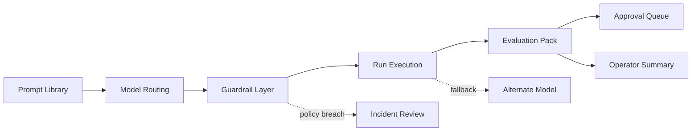

# AI Operations Console Architecture

## Service Overview

AI Operations Console is a frontend portfolio project designed to present prompt operations, model routing, evaluations, approvals, and guardrail incidents as one operator-facing control plane.

## Interface Flow

1. Static TypeScript datasets model prompts, routes, evaluations, approvals, incidents, and run history.
2. The React application translates those datasets into a control-plane interface with charts, routing tables, and action queues.
3. Recharts visualizations make quality, latency, and guardrail posture readable without turning the product into a reporting wall.

## Workspace Map

- `Hero`
  - positions the product as an internal AI operating system
- `Signal cards`
  - summarize quality, latency, risk, and spend posture
- `Evaluation trend`
  - shows quality, latency, and guardrail pass behavior over time
- `Prompt registry`
  - surfaces which prompts are approved, monitored, or waiting for review
- `Routing matrix`
  - clarifies which model handles which workflow and where approvals apply
- `Operator queue`
  - turns governance into next-step action
- `Guardrail incidents`
  - exposes policy failures and remediation priority
- `Run history`
  - shows recent output posture across cost and runtime

## Mermaid Flow

## Design Notes

- The visual language leans more control-plane and less dashboard to distinguish it from the revenue and executive surfaces already in the portfolio.
- The product highlights governance and quality tradeoffs instead of defaulting to a generic “AI assistant” frame.
- Mermaid is used directly in the docs so the workflow logic stays readable in GitHub.

## Future Upgrades

- side-by-side prompt diffing
- eval dataset drilldowns
- token-cost forecasting
- model-specific policy packs
- human-review queue filters
